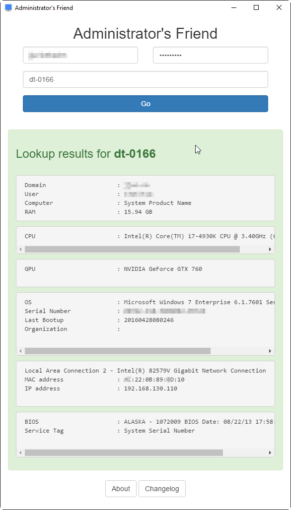
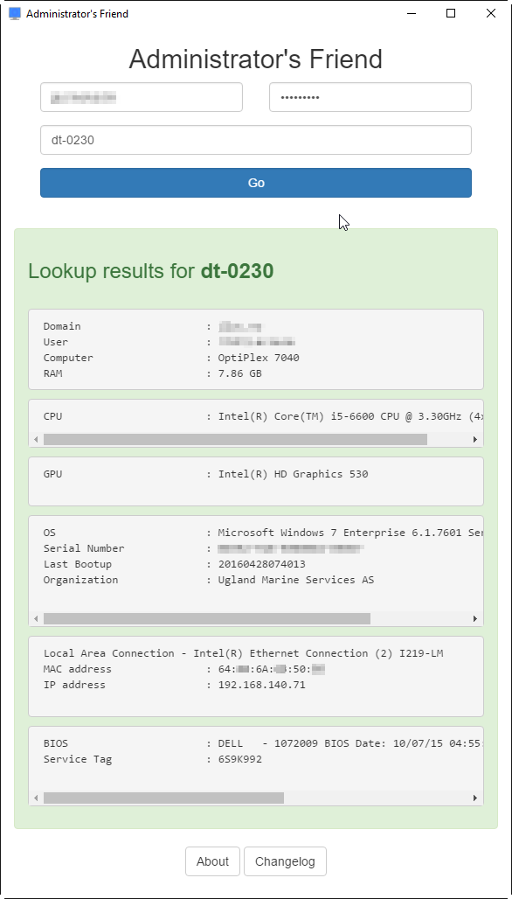

# Administrator's Friend

Small desktop utility for Windows to quickly retrieve computer information from WMI.

# pre-requisites

- `npm` / `node.js`

- `electron-packager`

- `python 2.7` or newer with `pywin32` lib

# instructions

`git clone https://github.com/kek91/administratorsfriend`

`electron-packager . --platform=win32 --arch=x64 --version="0.37.6" --out="App"`

# screenshot

## credits

http://www.robvanderwoude.com/wmigen.php

http://sourceforge.net/projects/pywin32/files/pywin32/

http://electron.atom.io
